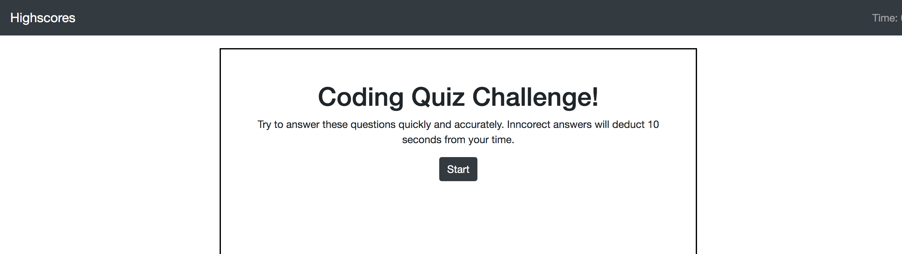

# Coding Quiz
Homework for Week 4
## Jiho John Kim

### Summary
* This is a short quiz about coding that has a timer and a score. 
    * The score is caculated by your time remaining with deductions from your time remaining for each wrong answer.
    * The start button starts the quiz and timer. 
    * When the quiz is over or the time runs out, you will get a form to enter initials and submit your score.
* Theoretically the score and initial should save to local storage and also update the HighScores page that is linked on the top left.

## ScreenShot
